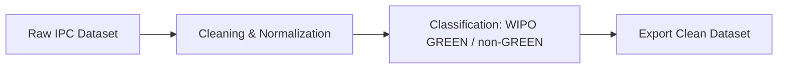

# ⚖️ IPC Codes Data Cleaning & Matching

This repository provides a **research-oriented pipeline** for preprocessing, cleaning, and classifying **Indian Penal Code (IPC) datasets** with Python.  
It integrates **standalone scripts** and **reproducible Jupyter Notebooks**, offering a structured methodology that supports both **general legal-tech analysis (non-GREEN)** and **WIPO GREEN–aligned studies** in sustainability and environmental innovation.

---

## 📂 Repository Contents
- **`clean_codes.py`** – Standalone script for quick cleaning of IPC codes. Removes extraneous symbols and spaces, then saves a cleaned CSV file.  
- **`IPC_Codes_Cleaning.ipynb`** – Notebook for systematic preprocessing, including regex-based text normalization, handling missing values, and dataset previews.  
- **`IPC_Codes_Matching.ipynb`** – Notebook for aligning IPC codes with **WIPO GREEN** and **non-GREEN** categories, enabling structured classification.

---

## ✨ Features
- **Data Cleaning** – Removal of noise, special characters, and whitespace.  
- **Normalization** – Consistent formatting of IPC codes for analysis.  
- **Classification** – Matching IPC codes to WIPO GREEN and non-GREEN domains.  
- **Research-Ready** – Stepwise explanations suitable for academic methodology.  
- **Export** – Cleaned datasets saved in CSV format for downstream tasks.  

---

## 🔄 Workflow



## 🚀 Usage
1. Clone the repository:
   ```bash
   git clone https://github.com/<your-username>/ipc-codes-cleaning.git
   cd ipc-codes-cleaning
   
2. Install required libraries:
   ```bash
   pip install pandas numpy

3. Run the script:
   ```bash
   python clean_codes.py

4. Explore the Jupyter Notebooks:
   ```bash
   jupyter notebook

# 🎯 Intended Audience

- Researchers exploring legal data, sustainability law, and policy frameworks.
- Data scientists building NLP models for legal-tech applications.
- Practitioners requiring reproducible preprocessing of IPC datasets.
