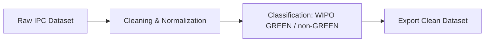

# ⚖️ IPC Codes Data Cleaning & Matching

This repository provides a **research-oriented pipeline** for preprocessing, cleaning, and classifying **Indian Penal Code (IPC) datasets** with Python.  
It integrates **standalone scripts** and **reproducible Jupyter Notebooks**, offering a structured methodology that supports both **general legal-tech analysis (non-GREEN)** and **WIPO GREEN–aligned studies** in sustainability and environmental innovation.

---

## 📂 Repository Contents
- **`clean_codes.py`** – Standalone script for quick cleaning of IPC codes. Removes extraneous symbols and spaces, then saves a cleaned CSV file.  
- **`IPC_Codes_Cleaning.ipynb`** – Notebook for systematic preprocessing, including regex-based text normalization, handling missing values, and dataset previews.  
- **`IPC_Codes_Matching.ipynb`** – Notebook for aligning IPC codes with **WIPO GREEN** and **non-GREEN** categories, enabling structured classification.

---

## ✨ Features
- **Data Cleaning** – Removal of noise, special characters, and whitespace.  
- **Normalization** – Consistent formatting of IPC codes for analysis.  
- **Classification** – Matching IPC codes to WIPO GREEN and non-GREEN domains.  
- **Research-Ready** – Stepwise explanations suitable for academic methodology.  
- **Export** – Cleaned datasets saved in CSV format for downstream tasks.  

---

## 🔄 Workflow


```mermaid
flowchart LR
    A[Raw IPC Dataset] --> B[Cleaning & Normalization]
    B --> C[Classification: WIPO GREEN / non-GREEN]
    C --> D[Export Clean Dataset]
```

## 🚀 Usage
1. Clone the repository:
   ```bash
   git clone https://github.com/<your-username>/ipc-codes-cleaning.git
   cd ipc-codes-cleaning
   
2. Install required libraries:
   ```bash
   pip install pandas numpy

3. Run the script:
   ```bash
   python clean_codes.py

4. Explore the Jupyter Notebooks:
   ```bash
   jupyter notebook

# 🎯 Intended Audience

- Researchers exploring legal data, sustainability law, and policy frameworks.
- Data scientists building NLP models for legal-tech applications.
- Practitioners requiring reproducible preprocessing of IPC datasets.


---

## 🌿 SDG Patent Harmonization & WIPO Green IPC Feature Extraction Pipeline

This repository includes the end-to-end pipeline for Indian Patent grant datasets harmonized with UN Sustainable Development Goals (SDG) target applications:

- **Target Dataset**: 360,924 records strictly matching Application nos SDG.xlsx (filing years 1995-2022).
- **Verified Baseline**: 48,972 Green Patents matching Green patents 48972.xlsx.
- **8 Feature Columns Generated**:
  1. IC_Code_Type (Green (1): **48,972** | Non-Green (0): **311,924** | NaN: **28**)
  2. Matched_IPC (Semicolon-separated matched green IPC codes)
  3. First_IPC_Green (Green (1): **29,072** | Non-Green (0): **331,824** | NaN: **28**)
  4. Matched_IPC_first (Green code matched by the primary IPC)
  5. 30-IPC-Green (Green (1): **34,301** | Non-Green (0): **326,595** | NaN: **28**)
  6. Matched_IPC-30 (Matched codes when >= 30% threshold met)
  7. 50-IPC-Green (Green (1): **26,542** | Non-Green (0): **334,354** | NaN: **28**)
  8. Matched_IPC-50 (Matched codes when >= 50% threshold met)

### Quick Links:
- 📖 [Complete Pipeline Documentation](docs/SDG_GREEN_PATENT_PIPELINE.md)
- 🎯 [First, 30%, and 50% Green IPC Matching Guide](docs/FIRST_30_50_IPC_MATCHING_GUIDE.md)
- 🚀 [Standalone Pipeline Script](sdg_green_patent_matching_pipeline.py)
- ⚡ [First / 30% / 50% Matching Script](sdg_pipeline/08_match_first_30_50_green_ipc.py)
- 📂 [Modular Processing Scripts](sdg_pipeline/)

